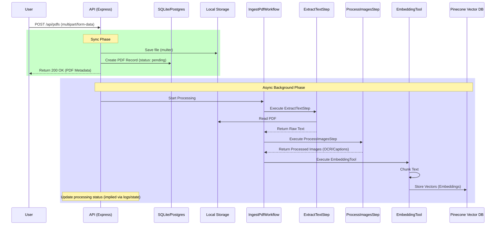
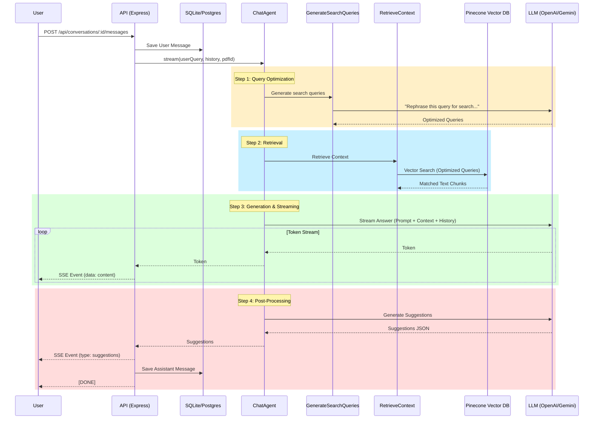

# AiQA System Operational Flows

This document details the core operational flows of the AiQA backend system, specifically focusing on PDF Ingestion and Chat Interaction.

## 1. PDF Ingestion Flow (RAG Setup)

This flow describes how a user uploads a PDF and how the system processes it to make it searchable via RAG (Retrieval-Augmented Generation).

### Overview
1.  **Upload:** User sends a PDF file via API.
2.  **Storage:** File is saved to local disk (`uploads/`) and metadata to Database.
3.  **Processing (Async):** The system triggers an asynchronous background process.
4.  **Extraction:** Text and images are extracted from the PDF.
5.  **Embedding:** Text is chunked, embedded (converted to vectors), and stored in Pinecone.

### Diagram

### Key Components

*   **Endpoint:** `POST /api/pdfs`
*   **Controller:** `src/routes/pdf.routes.ts`
*   **Workflow:** `src/agents/document/workflows/IngestPdfWorkflow.ts`
*   **Tools:**
    *   `EmbeddingTool`: Handles interaction with OpenAI (for embeddings) and Pinecone.
    *   `processPdf` (Service): Wrapper for `pdf-parse` or similar libraries.

---

## 2. Chat Interaction Flow (RAG Execution)

This flow describes how a user asks a question about a document and receives an AI-generated answer based on the document's content.

### Overview
1.  **Request:** User sends a message (query) associated with a PDF.
2.  **Context Building:** System analyzes the query and retrieves relevant chunks from Pinecone.
3.  **LLM Generation:** System constructs a prompt with the retrieved context and sends it to the LLM.
4.  **Response:** The LLM streams the answer back to the user, followed by suggested follow-up questions.

### Diagram

### Key Components

*   **Endpoint:** `POST /api/conversations/:id/messages`
*   **Controller:** `src/routes/conversation.routes.ts`
*   **Agent:** `src/agents/chat/ChatAgent.ts`
*   **Steps:**
    *   `GenerateSearchQueriesStep`: Optimizes user input for vector search.
    *   `RetrieveContextStep`: Queries Pinecone.
    *   `LlmTool`: Handles streaming interaction with the AI model.
